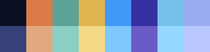

# Can_Opener: A colorscheme based off of [Vylet Pony's 'can opener's notebook: fish whisperer'](https://vyletpony.bandcamp.com/album/can-openers-notebook-fish-whisperer)

This is my personal color scheme inspired by [Vylet Pony's](https://twitter.com/vyletpony) latest album (as of May 06, 2022.)

The intent of this color scheme was to create something unique with dark, cooler hues to match the various art pieces drawn by [AstroEden.](https://twitter.com/astro_eden)

The colors are loosely based off of [Oceanic Next,](https://github.com/mhartington/oceanic-next) with colors derived mostly from [this drawing.](https://twitter.com/astro_eden/status/1496311952544759808)
